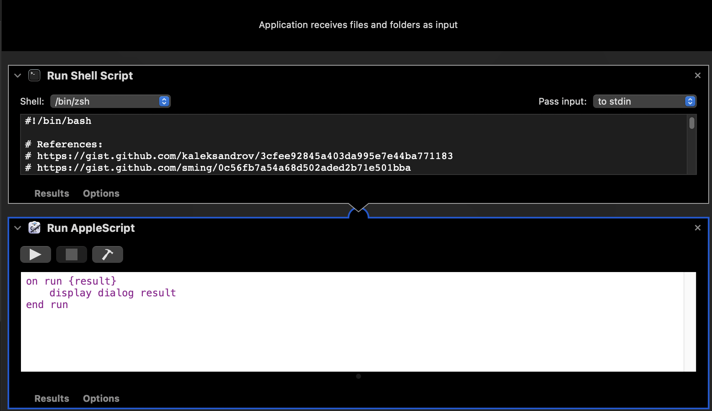

# GlobalProtect handler

I modified the shell script such that the GlobalProtect application can be killed and to prevent the daemon from spawning more processes upon kill.

## Instructions

1. Go to [link](https://github.com/HiIAmTzeKean/GlobalProtect-Handler/releases/tag/v1.0) to download workflow
2. Open workflow
3. Run the action within automator

## Additional notes

You can download the workflow from release and run it in automator. Otherwise, you can clone the repo to obtain the app. Note that you cannot run the app as a standalone since by definition the app needs to take an input which I cannot simulate.

Otherwise, if you are a power user, you can directly run the shell script in terminal.

## Screenshot of automator

